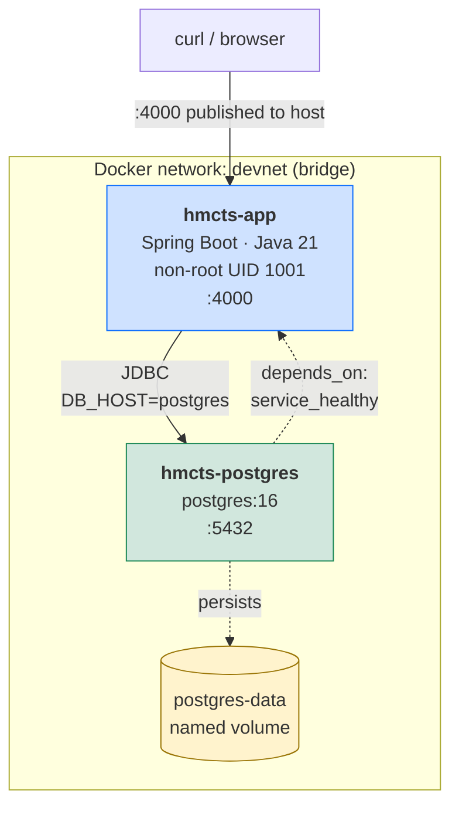
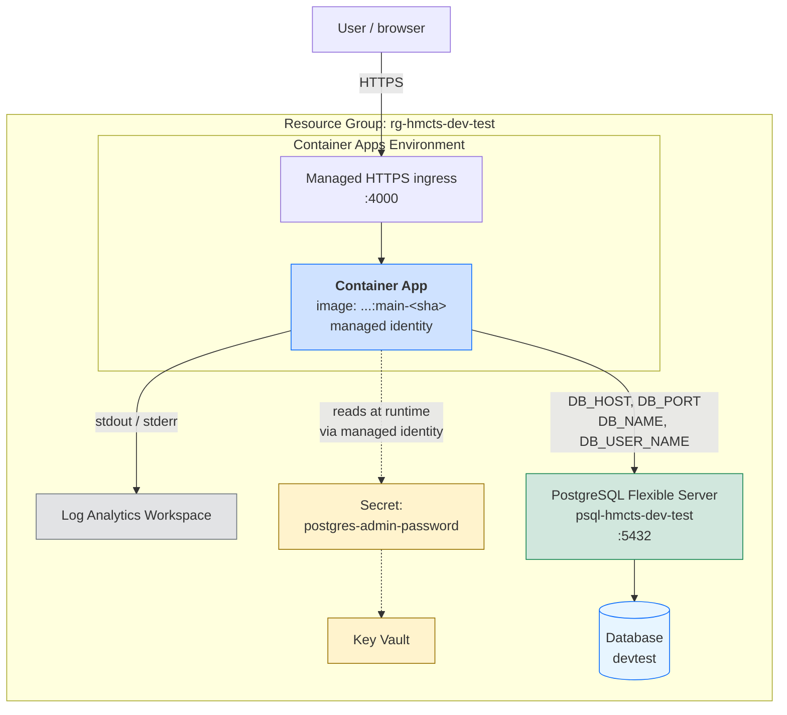

# HMCTS DevOps Technical Test

A containerised Spring Boot service with CI/CD, security scanning, and
Terraform infrastructure for Azure. Built as a platform engineering
demonstration: the application is deliberately minimal, and the
interesting work is the delivery rails around it.

---

## What this is

A Spring Boot REST service that exposes one endpoint —
`GET /get-example-case` — returning a hardcoded example case object.
It is a **scaffold**, not a case management system. The brief specified
config-only changes and no new Java code.

What the repository actually demonstrates:

- A **multi-stage Dockerfile** producing a non-root runtime image with
  a healthcheck wired to the Spring Boot actuator
- A **Docker Compose stack** running the app and a real PostgreSQL,
  with healthcheck-gated startup ordering
- **Two path-filtered GitHub Actions pipelines** — one for application
  code, one for Terraform
- A **Trivy security gate** that blocks on CRITICAL and reports HIGH,
  which caught three real CVEs on its first run
- **Terraform** describing an Azure deployment: Container Apps,
  PostgreSQL Flexible Server, Key Vault, Log Analytics
- **Seven Architecture Decision Records** documenting every non-obvious
  choice, including the options rejected

---

## Quick start

**Prerequisites:** Docker Desktop.

```bash
git clone git@github.com:evo-ai-g/-hmcts-devops-test.git
cd -hmcts-devops-test
cp .env.example .env
docker compose up -d
```

Wait ~40 seconds for the JVM to boot and the healthcheck to pass. Then:

```bash
curl http://localhost:4000/health
```

Expected response includes:

```json
{
  "status": "UP",
  "components": {
    "db": {
      "status": "UP",
      "details": { "database": "PostgreSQL", "validationQuery": "isValid()" }
    }
  }
}
```

The `db` component's `UP` status confirms the app has an open, validated
connection to PostgreSQL.

```bash
curl http://localhost:4000/get-example-case
```

Returns the example case object.

**Shut down:**

```bash
docker compose down       # keeps the Postgres data volume
docker compose down -v    # also deletes the volume
```

---

## Architecture



**Startup order is enforced by healthchecks.** The app does not start
until Postgres reports healthy via `pg_isready`. Postgres data persists
in a named volume across `docker compose down`.

**Postgres is not published to the host.** It is reachable only from
containers on `devnet`. The app reaches it via the compose service name
(`DB_HOST=postgres`), resolved by Docker's embedded DNS.

**Startup order is enforced by healthchecks.** The app does not start
until Postgres reports healthy via `pg_isready`. Postgres data persists
in a named volume across `docker compose down`.

**Postgres is not published to the host.** It is reachable only from
containers on `devnet`. The app reaches it via the compose service name
(`DB_HOST=postgres`), resolved by Docker's embedded DNS.

### Configuration

All environment-specific values are externalised. The app reads them
from environment variables injected by Compose, which reads them from
`.env` (gitignored):

| Variable | Purpose |
|---|---|
| `SERVER_PORT` | Port the app listens on |
| `DB_HOST` | Postgres hostname (`postgres` inside Compose) |
| `DB_PORT` | Postgres port |
| `DB_NAME` | Database name |
| `DB_USER_NAME` | Database user |
| `DB_PASSWORD` | Database password |

`.env.example` is committed and declares the shape. `.env` is local
and holds the values. No credentials appear in the repository.

---

## Repository structure

```
.
├── .github/workflows/
│   ├── app-ci.yml              # path-filtered: src/, Dockerfile, build.gradle
│   └── infra-ci.yml            # path-filtered: terraform/
├── config/                     # Checkstyle configuration (from starter)
├── docs/
│   └── adr/                    # 7 Architecture Decision Records
├── src/main/
│   ├── java/                   # Spring Boot application (unchanged from starter)
│   └── resources/
│       └── application.yaml    # datasource + actuator config
├── terraform/
│   ├── versions.tf             # provider and CLI version constraints
│   ├── variables.tf            # typed, described inputs
│   ├── main.tf                 # resources
│   ├── outputs.tf              # typed, described outputs
│   └── backend.tf              # commented remote state config
├── .dockerignore               # keeps build context small and secret-free
├── .env.example                # committed config contract
├── .gitattributes              # enforces LF on gradlew, *.tf, *.hcl
├── .gitignore                  # excludes .env, build/, .terraform/
├── Dockerfile                  # multi-stage, non-root, healthchecked
├── docker-compose.yml          # local stack with Postgres
└── build.gradle                # Postgres driver + JDBC starter added
```

---

## The CI/CD pipeline

Two GitHub Actions workflows, each path-filtered so a change only
triggers the pipeline it affects.

### `app-ci.yml`

Triggers on changes to `src/**`, `build.gradle`, `gradle/**`, `gradlew`,
`config/**`, `Dockerfile`, `.dockerignore`, `docker-compose.yml`, or the
workflow file itself.

**Job 1 — Build and test**
1. Check out the repository
2. Install Temurin JDK 21 with Gradle caching
3. `./gradlew build --no-daemon` — compiles, runs Checkstyle, runs tests,
   packages the fat jar
4. Upload test results and the jar as workflow artefacts

**Job 2 — Build image and scan** (runs after job 1 passes)
1. Compute two image tags: `main` (or `pr-N`) and `main-<short-sha>`
2. Build the image using Buildx with GitHub Actions layer caching
3. **Trivy report pass** — scan for CRITICAL and HIGH, print to log,
   never fail
4. **Trivy gate pass** — scan for CRITICAL only, fail the pipeline if any
   are found

The two-pass design exists because Trivy's `exit-code` applies to any
finding at or above the configured severity. A single run at
`CRITICAL,HIGH` with `exit-code: 1` would block on HIGH too, contradicting
the brief. See [ADR 0003](docs/adr/0003-ci-and-security-scanning.md).

### `infra-ci.yml`

Triggers on changes to `terraform/**` only.

1. Install Terraform 1.9.x
2. `terraform fmt -check -recursive` — fail if any file is not canonically
   formatted
3. `terraform init -backend=false` — download providers without needing
   Azure credentials
4. `terraform validate` — check syntax and provider schema conformance

`-backend=false` is why this pipeline runs without an Azure account. It
downloads the provider plugins so `validate` can resolve resource
schemas, but skips backend initialisation (which would require
credentials and remote state).

### Image tagging strategy

Every image gets two tags:

- **Role tag** — `main` or `pr-N`. Human-readable. Tells you where the
  image came from.
- **Immutable tag** — `main-0f9ec57` or `pr-42-abc1234`. Ties the image
  to the exact commit that produced it.

The role tag is mutable by design. The immutable tag is the handle for
anything that needs a stable reference. See
[ADR 0002](docs/adr/0002-docker-image-tagging.md).

### What blocks a merge

Branch protection rules on `main`:
- Require a pull request before merging (0 required approvals, since
  this is a solo repository)
- Require `App CI / Build and test` and `App CI / Build image and scan`
  to pass
- Require branches to be up to date before merging
- Block force-pushes
- Block deletions

On GitHub's free tier for private repositories, these rules are stored
but not enforced. They activate automatically when the repository becomes
public, or when the organisation upgrades to GitHub Team. See
[ADR 0005](docs/adr/0005-github-tier-constraints.md).

---

## Infrastructure (Terraform)



`terraform/` describes an Azure deployment. It has been validated
(`terraform fmt -check` and `terraform validate` pass) but not applied —
no Azure account was used, per the brief.

### What it provisions

| Resource | Purpose |
|---|---|
| Resource group | Container for all resources |
| Log Analytics workspace | Receives container logs; required by Container Apps Environment |
| Container Apps Environment | Shared runtime and network for containers |
| PostgreSQL Flexible Server | Managed Postgres |
| PostgreSQL database | The `devtest` database inside the server |
| PostgreSQL firewall rule | Allows Azure-internal services to connect |
| Key Vault | Stores the Postgres admin password |
| Key Vault secret | The password entry itself |
| Container App | Runs the application image |
| Role assignment | Grants the Container App's managed identity read access to Key Vault |

### How the app gets its database credentials

The password never appears in the Container App's configuration.

1. Terraform writes the password to Key Vault as a secret
2. The Container App has a system-assigned managed identity
3. A role assignment grants that identity "Key Vault Secrets User" on the vault
4. The Container App's `secret` block references the Key Vault secret by
   its **versionless ID**
5. The app's `DB_PASSWORD` environment variable points at that secret name

Using the versionless ID means password rotation is automatic — a new
secret version is picked up on next container start, with no Terraform
change and no redeploy.

### How it's structured

- `versions.tf` — Terraform CLI and provider version constraints
- `variables.tf` — every input, typed, described, with validation rules
  where values must come from a fixed set
- `main.tf` — the resources, with `local.common_tags` applied to all
- `outputs.tf` — resource names, URLs, and connection details for
  downstream consumers
- `backend.tf` — commented-out remote state configuration with an
  explanation of the strategy

### State management

The backend block is commented out. For a real deployment, state would
live in Azure Storage with one blob key per environment
(`hmcts-dev-test/dev.tfstate`, `hmcts-dev-test/staging.tfstate`, etc.),
authenticated via Azure AD rather than storage account keys. See
[ADR 0007](docs/adr/0007-terraform-state-management.md).

### Tagging strategy

Every resource receives six tags:

| Tag | Purpose |
|---|---|
| `environment` | Distinguishes dev / staging / prod |
| `project` | Groups resources by workload |
| `owner` | Team accountable for the resources |
| `managed-by` | Signals "do not edit in portal" |
| `cost-centre` | Finance attribution |
| `data-classification` | UK government scheme: official / secret / top-secret |

See [ADR 0006](docs/adr/0006-azure-tagging-strategy.md).

### How it would be deployed

```bash
cd terraform
terraform init
terraform plan  -var="postgres_admin_password=$TF_VAR_postgres_admin_password"
terraform apply -var="postgres_admin_password=$TF_VAR_postgres_admin_password"
```

The password is supplied via the `TF_VAR_` environment variable
convention, never written to a file. `terraform destroy` removes
everything.

---

## Platform engineering decisions

Every non-obvious choice in this repository has a recorded reason.
The full reasoning lives in the ADRs; this section is the summary.

### The Dockerfile is a golden path

A **golden path** is a pre-built, recommended way to accomplish a
common task, so that teams don't each invent their own. The Dockerfile
here is shaped as a template: multi-stage, non-root, healthchecked,
with build configuration copied before source so dependency resolution
caches across source-only edits. A team containerising another Spring
Boot service can copy this file, change the jar name, and get a correct
image without needing to reason about Docker layer caching, user IDs,
or healthcheck semantics.

### Compose is a paved road

A **paved road** is a golden path for a developer's daily workflow. The
`docker-compose.yml` here gives any engineer who clones the repository
a working application and a real PostgreSQL in one command, with
startup ordering enforced by healthchecks. No tribal knowledge, no
"ask the person who set it up", no half-configured local environment.
The safe path is the easy path.

### The pipelines are delivery rails

A **delivery rail** is the automated sequence from commit to deployable
artefact. `app-ci.yml` runs the same `./gradlew build` a developer runs
locally, then builds the image, then scans it. A commit that passes
locally passes in CI because the commands are identical. The pipeline
doesn't invent a different process — it automates the one that already
works.

### Path filters keep the signal meaningful

A red check that's irrelevant to the change teaches people to ignore
red checks. Path filters mean every failing check on a pull request is
about the change in that pull request. That's what keeps a security
gate alive over time — not the severity threshold, but the fact that
people still read the result.

### Security scanning is shift-left

**Shift left** means moving a check earlier in the lifecycle. Trivy
scans the image during CI, before it reaches any registry, any
environment, or any user. The vulnerability is caught at build time,
by the person who introduced it, when the fix is cheapest.

---

## Security controls

Every control below is deliberate. None is an accident of a base image
or a default setting.

### Container

| Control | Where |
|---|---|
| Non-root runtime user (UID 1001) | `Dockerfile` |
| Multi-stage build — no compiler, no source, no Gradle in the shipped image | `Dockerfile` |
| `curl` installed explicitly for the healthcheck, not assumed present | `Dockerfile` |
| `.dockerignore` excludes `.env`, `.git`, build output, IDE state | `.dockerignore` |
| Only one port exposed (`4000`) | `Dockerfile`, `docker-compose.yml` |
| Postgres not published to the host — reachable only from the Compose network | `docker-compose.yml` |

### Secrets

| Control | Where |
|---|---|
| `.env` gitignored, `.env.example` committed instead | `.gitignore`, `.env.example` |
| No credentials in any committed file | repository-wide |
| Key Vault for the Postgres password in the Azure design | `terraform/main.tf` |
| Container App reads the password via managed identity, not a plain env var | `terraform/main.tf` |
| Versionless Key Vault secret ID — rotation needs no redeploy | `terraform/main.tf` |
| Password supplied at apply time via `TF_VAR_`, never written to a file | `README.md`, `terraform/variables.tf` |

### Pipeline

| Control | Where |
|---|---|
| Trivy gate blocks the build on CRITICAL findings | `app-ci.yml` |
| Trivy reports HIGH findings without blocking | `app-ci.yml` |
| `--ignore-unfixed` — the gate only fires on actionable findings | `app-ci.yml` |
| `GITHUB_TOKEN` scoped to least privilege (`contents: read`, `security-events: write`) | `app-ci.yml` |
| Dependabot alerts and security updates enabled | repository settings |

### Application

| Control | Where |
|---|---|
| Actuator health endpoints exposed (`health` only, not `*`) | `application.yaml` |
| Database readiness indicator registered as a named health group | `application.yaml` |

### Deliberate decision: fix, don't suppress

The Trivy gate caught three CRITICAL CVEs on its first run —
`CVE-2026-65182`, `CVE-2026-65905`, `CVE-2026-68525`, all auth-bypass
issues in `tomcat-embed-core` 11.0.24. All three had a fix available in
11.0.25.

The easy path was a `.trivyignore` file. The correct path was to
override the Spring Boot BOM's pinned Tomcat version and rebuild. A
suppression is only appropriate when no fix exists, or when the
vulnerable code path is unreachable in the deployment — neither applied.
See [ADR 0004](docs/adr/0004-trivy-cve-response.md).

### Known limitations

- **No SARIF upload to the GitHub Security tab.** Code scanning is
  gated to public repositories or GitHub Advanced Security on private
  ones. Trivy findings print to the workflow log instead. See
  [ADR 0005](docs/adr/0005-github-tier-constraints.md).
- **CodeQL removed.** Same constraint. The starter's workflow targeted
  `master` and Java 17, both of which were also stale.
- **No image signing or SBOM.** Would be added alongside a registry
  push in a production pipeline.

---

## Operational resilience

Resilience here means the system copes with failure without a human
having to intervene.

### Healthchecks at every layer

| Layer | Mechanism | What "healthy" means |
|---|---|---|
| Container (app) | `HEALTHCHECK` in `Dockerfile`, polls `/health` | The JVM is up and the datasource indicator passes |
| Container (Postgres) | `pg_isready` in `docker-compose.yml` | The server is accepting connections, not just running |
| Application | Actuator `/health` and `/health/readiness` | Readiness group includes the `db` indicator |

### Liveness and readiness are separate concerns

A single health endpoint answers one question. Two answer two:

- **Liveness** — is the process alive? If not, restart it.
- **Readiness** — can it serve traffic? If not, stop routing to it.

The readiness group is configured to include only the `db` indicator.
If PostgreSQL becomes unreachable, the container stays alive but reports
unready, so an orchestrator can stop sending it traffic without
restarting it into the same failure.

### Startup ordering is enforced, not hoped for

`depends_on: condition: service_healthy` on the app service means
Docker does not start the app until Postgres has passed its healthcheck.
The alternative — starting both and letting the app retry — produces
noisy startup logs and slow local iteration. Ordering is a platform
concern, not something a developer should have to work around.

### Restart policy

`restart: unless-stopped` on the app service means a crashed container
is restarted automatically, but a manually stopped one stays stopped.
That is the intended behaviour for a development environment: recover
from crashes, respect intentional stops.

### Graceful shutdown

`server.shutdown: graceful` in `application.yaml` means in-flight
requests are allowed to complete during shutdown, rather than being cut
off. Combined with the healthcheck, an orchestrator can drain a
container before terminating it.

### Startup budget

The Dockerfile healthcheck uses `--start-period=40s`. The JVM takes time
to boot; without this window, a cold start would be marked unhealthy
before it had a chance to become healthy. The value was chosen by
measuring a cold boot in Compose (~25 seconds) and doubling it for
margin.

---

## Branch and release strategy

### Branching

- `main` is the trunk. It is always in a working state.
- All changes go via pull request. Direct pushes to `main` are blocked
  by branch protection (dormant on the free private tier — see
  [ADR 0005](docs/adr/0005-github-tier-constraints.md)).
- Feature branches are named for the change: `fix-tomcat-cves`,
  `add-terraform-backend`.

### What runs where

| Event | `app-ci.yml` | `infra-ci.yml` |
|---|---|---|
| Push to `main` touching `src/**` or app config | ✅ | — |
| Push to `main` touching `terraform/**` | — | ✅ |
| Pull request touching `src/**` | ✅ | — |
| Pull request touching `terraform/**` | — | ✅ |
| Docs-only change | — | — |

### What blocks a merge

Branch protection on `main` requires:
1. A pull request (no direct pushes)
2. `App CI / Build and test` to pass
3. `App CI / Build image and scan` to pass
4. The branch to be up to date with `main` before merging
5. No force-push and no deletion of `main`

`Infra CI / Format and validate` is **not** in the required list because
it has not yet run green on `main` — the `terraform/` directory is newer
than the workflow. The convention is: never add a check to the required
list until it is green. Adding a new pipeline to a protected branch must
not freeze all merges while its teething problems are resolved.

### Image tags

Two tags per image, per [ADR 0002](docs/adr/0002-docker-image-tagging.md):

- Role tag (`main`, `pr-42`) — what the image is for
- Immutable tag (`main-0f9ec57`) — which commit produced it

### Release

There is no release process in this repository. It is a technical test,
not a product. Adding one would mean:

1. A registry (GHCR or ACR)
2. A `docker push` step in `app-ci.yml`
3. Semantic version tags driven by git tags
4. A deploy job triggered by a tag, applying Terraform with the new
   image reference

That is a small extension to the existing structure, not a redesign.

---

## Assumptions and trade-offs

### Assumptions

- **The application is a scaffold.** It exposes one endpoint returning a
  hardcoded object. No persistence code exists, so the database wiring
  proves connectivity rather than serving queries. The brief forbade new
  Java code, and this is consistent with that constraint.
- **No Azure account was available.** Terraform is validated
  (`fmt -check`, `validate`) but never applied. `plan` and `apply`
  require credentials and a subscription.
- **Solo repository.** Zero required approvals on pull requests, since
  GitHub does not permit self-approval. This would be raised to 1 the
  moment a second contributor joined.
- **Private repository during the build.** This gates code scanning,
  rulesets, and branch protection enforcement. All are documented and
  would activate on going public or upgrading to GitHub Team.

### Trade-offs taken deliberately

| Choice | Alternative | Why |
|---|---|---|
| Temurin Jammy runtime | Alpine | glibc parity with Azure Postgres and the local JDK; 100 MB saved is not worth musl surprises |
| JDBC starter | JPA starter | No entities exist; JPA would add Hibernate as unused weight |
| Container Apps | App Service | The input is a container image; scale-to-zero; the direction Azure is steering container workloads |
| Two tags per image | One tag | Role tag for humans, immutable tag for traceability — different questions |
| Two Trivy passes | One | `exit-code` applies to any severity at or above the threshold |
| Fix the CVEs | Suppress them | Suppression is for unfixable findings or unreachable paths |
| Path-filtered workflows | Single workflow | Every red check stays meaningful |
| Separate state keys per environment | Workspaces | Workspaces share backend and IAM; the isolation is a naming convention, not a boundary |
| Azure AD for backend auth | Storage account keys | No long-lived credential to rotate or leak |
| No registry push | Push to GHCR/ACR | Keeps credentials out of scope; two lines to add when a target exists |

---

## What I'd do with more time

In rough priority order.

### 1. Apply the platform layer to a second service

The most valuable demonstration of a golden path is that it works for a
second, different application. I have a working FastAPI CRUD service
(Python) with its own Dockerfile, Compose file, and pytest pipeline.
Porting the platform layer from this repository onto it would prove the
rails are app-agnostic: same CI structure, same Trivy gate, same
Terraform shape, same tagging discipline, different language and
runtime. Only the Dockerfile's build stage and the dependency manifest
change.

That is the platform engineering claim made concrete.

### 2. A scheduled non-blocking vulnerability scan

The Trivy gate uses `--ignore-unfixed`, which means findings without a
patch are invisible to it. That is the correct behaviour for a blocking
gate — every failure should be actionable — but it leaves a visibility
gap. A weekly scheduled scan without the flag, reporting all severities
to the Security tab, closes it without adding friction to the merge
process.

### 3. Registry push and image signing

The pipeline builds and scans the image but does not publish it. Adding
a push step to GitHub Container Registry or Azure Container Registry
makes the scanned artefact the deployable one — the SHA-tagged image
that passed Trivy is the exact image that reaches an environment. From
there, cosign signing and an SBOM would complete the supply-chain story.

### 4. Production hardening of the Terraform

The current design is deliberately dev-appropriate:

- `public_network_access_enabled = true` with an Azure-services firewall
  rule — a production deployment would use a private endpoint inside a
  VNet
- `purge_protection_enabled = false` — would be `true` in production
- `container_min_replicas = 0` for scale-to-zero — production would use
  a minimum of 2 across availability zones
- Single region — production would consider a paired region for
  disaster recovery
- No autoscaling rules — would add HTTP-concurrency scaling

### 5. Observability beyond healthchecks

Healthchecks answer "is it up". They do not answer "is it healthy" in
the sense of latency, error rate, or saturation. The natural next step
is OpenTelemetry instrumentation exporting to Azure Monitor, plus a
dashboard and a small number of alert rules on the metrics that matter
(request rate, error rate, p95 latency, connection pool saturation).

### 6. Restore CodeQL and branch protection enforcement

Both are configured or available but gated by the private-repository
tier. Publicising the repository or upgrading to GitHub Team turns
both on with no further work.

---

## Decision records

Every non-obvious decision has a one-page record in `docs/adr/`,
following the Context / Decision / Consequences format, including the
options that were rejected.

| ADR | Decision |
|---|---|
| [0001](docs/adr/0001-use-jdbc-not-jpa.md) | Use `spring-boot-starter-jdbc` instead of `-data-jpa` |
| [0002](docs/adr/0002-docker-image-tagging.md) | Two image tags per build: role tag and immutable SHA tag |
| [0003](docs/adr/0003-ci-and-security-scanning.md) | Path-filtered pipelines; Trivy two-pass design; no registry push |
| [0004](docs/adr/0004-trivy-cve-response.md) | Fix the Tomcat CVEs by overriding the BOM, rather than suppressing |
| [0005](docs/adr/0005-github-tier-constraints.md) | Document GitHub free-tier constraints and the fallbacks taken |
| [0006](docs/adr/0006-azure-tagging-strategy.md) | Six-tag scheme: environment, project, owner, managed-by, cost-centre, data-classification |
| [0007](docs/adr/0007-terraform-state-management.md) | Separate state key per environment; Azure AD auth; workspaces rejected |

---

## Licence

MIT — inherited from the HMCTS starter repository.